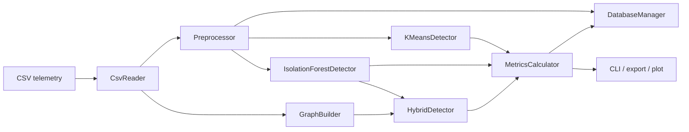

# Пояснительная записка к курсовому проекту

## Тема

Интеллектуальная система анализа телеметрии серверной инфраструктуры дата-центров.

Студент: Буторов Г.А.  
Группа: ИУ1-62Б  
Кафедра: ИУ-1 "Системы автоматического управления"  
Руководитель: П.А. Панилов

## 1. Введение

Современные дата-центры и суперкомпьютерные комплексы формируют большие потоки телеметрии: температуры CPU/GPU, потребляемая мощность, входная мощность блоков питания, режимы нагрузки и другие параметры. Ручной анализ таких данных затруднен из-за объема, высокой частоты измерений и взаимного влияния соседних узлов.

Цель работы - разработать программную систему на C++17 для загрузки, предобработки, хранения и интеллектуального анализа телеметрии серверных узлов. Система обнаруживает аномалии методами k-means, Isolation Forest и гибридным алгоритмом с графовой верификацией.

## 2. Требования

Система должна:

- читать CSV-файл Summit-like формата, включая `hostname`, временную метку и числовые телеметрические параметры;
- удалять строки с NaN;
- вносить синтетические аномалии до нормализации;
- выполнять Z-нормализацию и опционально формировать признаки скользящего окна;
- классифицировать режим нагрузки как `low`, `normal`, `high`;
- строить граф соседства серверных узлов по префиксу `hostname`;
- запускать k-means, Isolation Forest и гибридный IF + graph;
- считать Precision, Recall, F1 по синтетическим аномалиям;
- сохранять данные и результаты в SQLite или fallback CSV-хранилище;
- предоставлять CLI-меню и пакетный режим запуска.

## 3. Архитектура

Приложение имеет модульную многоуровневую архитектуру.



## 4. Модули реализации

- `CsvReader` читает CSV, определяет `hostname`, timestamp и числовые колонки.
- `Preprocessor` удаляет NaN, добавляет синтетические аномалии, классифицирует нагрузку, выполняет Z-нормализацию.
- `KMeansDetector` реализует k-means++ и параллельное вычисление расстояний.
- `IsolationForestDetector` строит ансамбль деревьев в нескольких потоках и рассчитывает anomaly score в диапазоне `[0, 1]`.
- `GraphBuilder` строит граф по префиксу имени узла; при наличии Boost подключается Boost.Graph.
- `HybridDetector` подтверждает кандидатов IF, если у узла есть сосед-кандидат в графе.
- `MetricsCalculator` считает TP, FP, FN, TN, Precision, Recall, F1.
- `DatabaseManager` создает таблицы `telemetry`, `normalized_features`, `synthetic_anomalies`, `execution_log`, `anomaly_results`.
- `Visualizer` экспортирует ряд в CSV и вызывает Python/matplotlib для PNG-графика.

## 5. Алгоритмы

### k-means

Используется `k=3`, инициализация k-means++, максимум 60 итераций. Аномальность определяется по расстоянию до центроида: порог равен `mean + 2.5 * std`. Для защиты от маскировки одиночного выброса отдельным центроидом добавлена проверка малых кластеров.

### Isolation Forest

Используются 100 деревьев, подвыборка до 256 объектов, порог score `0.6`. Построение деревьев и расчет оценок выполняются параллельно через `std::thread`.

### Гибридный алгоритм

1. Isolation Forest формирует кандидатов.
2. По `hostname` строится граф соседства стойки.
3. Кандидат подтверждается, если соседний узел также является кандидатом.

Такой подход уменьшает число ложных срабатываний за счет учета пространственной близости узлов.

## 6. База данных

SQLite-схема:

- `telemetry(record_id, timestamp, hostname, workload_mode, ...)`
- `normalized_features(record_id, ...)`
- `synthetic_anomalies(record_id, description)`
- `execution_log(run_id, started_at, algorithm, parameters, rows_processed, execution_ms, threshold, tp, fp, fn, tn, precision_value, recall_value, f1_value)`
- `anomaly_results(run_id, record_id, algorithm, is_anomaly, score, execution_ms)`

Если SQLite3 dev-библиотека отсутствует при сборке, используется fallback-директория `telemetry.sqlite.files` с CSV и SQL-описанием.

## 7. Тестирование

Демонстрационный запуск:

```bash
./build/telemetry_analyzer --csv data/sample_telemetry.csv --algorithm all --threads 2 --window 2
```

Проверяются:

- загрузка CSV;
- удаление NaN;
- внесение 0.5% синтетических аномалий;
- нормализация;
- построение графа;
- запуск трех алгоритмов;
- расчет метрик;
- сохранение и экспорт результатов.

В локальном smoke-тесте на `data/sample_telemetry.csv` k-means обнаружил синтетическую аномалию с F1 = 1.0, Isolation Forest показал Recall = 1.0, а гибридный алгоритм уменьшил число ложных срабатываний относительно чистого IF.

## 8. Выводы

Разработана практическая C++17-система для анализа телеметрии серверной инфраструктуры. Система поддерживает расширение новыми алгоритмами, источниками данных и способами визуализации. Реализованы хранение результатов, многопоточность, графовая верификация и CLI-интерфейс, что соответствует основным требованиям курсового проекта.

## 9. Список литературы

1. Liu F. T., Ting K. M., Zhou Z.-H. Isolation Forest. IEEE ICDM, 2008.
2. Arthur D., Vassilvitskii S. k-means++: The Advantages of Careful Seeding. SODA, 2007.
3. Документация SQLite: https://www.sqlite.org/docs.html
4. Документация Boost.Graph: https://www.boost.org/doc/libs/release/libs/graph/
5. Описание телеметрических наборов данных суперкомпьютера Summit, README датасета.
