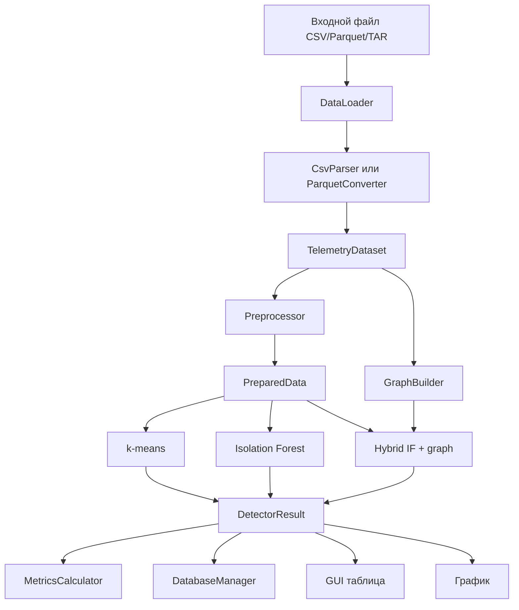
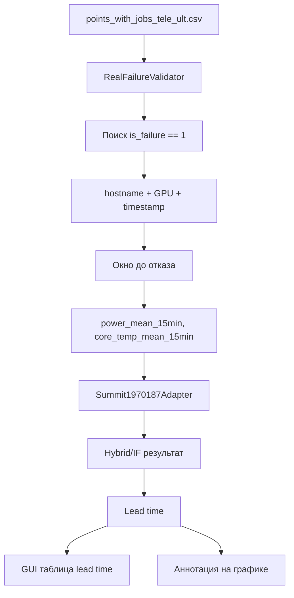

# Подробный журнал разработки и техническое описание курсового проекта

Документ описывает итоговое состояние проекта `project_KP` и предназначен как основа для пояснительной записки. В нем собраны назначение системы, структура каталогов, входные данные, используемые таблицы, архитектура, модули C++, алгоритмы, база данных, GUI, сборка, Docker, тестирование и ограничения.

Проект: интеллектуальная система анализа телеметрии серверной инфраструктуры дата-центров.

Язык реализации: C++17.

Основной интерфейс: Qt Widgets.

База данных: PostgreSQL в Docker, SQLite или CSV fallback для локальной отладки.

Основные алгоритмы: k-means, Isolation Forest, гибридный Isolation Forest + граф соседства.

Метрики курсового проекта: Precision, Recall, F1.

## 1. Назначение и цель системы

Цель проекта - разработать практическую программную систему, которая выполняет полный цикл обработки телеметрии серверной инфраструктуры:

1. Загружает данные из CSV, Parquet и TAR-архивов.
2. Приводит данные к единому внутреннему представлению.
3. Удаляет некорректные строки и нормализует числовые признаки.
4. Строит граф соседства узлов по именам `hostname`.
5. Запускает алгоритмы обнаружения аномалий.
6. Сохраняет исходные данные, нормализованные признаки, результаты и журнал запусков.
7. Показывает результаты в GUI.
8. Строит график телеметрии и подсвечивает аномалии.
9. Выполняет отдельную демонстрационную валидацию на втором датасете 1970187.

Система предназначена для анализа телеметрии суперкомпьютерных узлов. В РПЗ это можно сформулировать так: приложение автоматизирует обнаружение аномальных состояний по параметрам мощности и температуры и предоставляет оператору удобный интерфейс для запуска анализа и просмотра результатов.

## 2. Краткий итог реализации

На текущий момент реализованы:

- CLI-приложение `telemetry_analyzer`;
- Qt GUI `telemetry_gui`;
- загрузка CSV, Parquet, TAR;
- Apache Arrow/parquet-cpp путь для Parquet и Python fallback;
- CSV-парсер с выбором нужных Summit-колонок;
- предобработка: удаление NaN, Z-нормализация, режим нагрузки, moving average;
- хранение в PostgreSQL, SQLite или fallback CSV;
- построение графа соседства по hostname;
- k-means;
- Isolation Forest с 100 деревьями;
- гибридный IF + graph;
- отдельный адаптер `Summit1970187Adapter` для второго датасета;
- валидатор `RealFailureValidator` для `points_with_jobs_tele_ult.csv` и `is_failure == 1`;
- расчет lead time;
- экспорт результатов в CSV;
- Dockerfile, docker-compose.yml, .env;
- документация и скрипты сборки.

## 3. Какие таблицы используются для второго датасета 1970187

Это самый важный практический вопрос по второму датасету.

В папке `second_dataset/` находятся три CSV-файла:

```text
second_dataset/
  points_with_jobs_tele_ult.csv
  failures.csv
  locations_by_serials.csv
```

Фактически в текущей реализации для работы со вторым датасетом используется только:

```text
points_with_jobs_tele_ult.csv
```

Из этой таблицы берутся поля:

- `timestamp` - время записи или события;
- `hostname` - имя вычислительного узла;
- `GPU` - номер GPU, от 0 до 5;
- `is_failure` - ground truth, 1 означает реальный DBE-сбой;
- `power_mean_15min` - средняя мощность за 15 минут;
- `core_temp_mean_15min` - средняя температура ядра за 15 минут.

Файлы `failures.csv` и `locations_by_serials.csv` сейчас не участвуют в расчетах. Они оставлены в проекте как вспомогательные файлы на случай будущего расширения, но текущий валидатор 1970187 их не читает.

Отдельной SQL-таблицы именно для второго датасета нет. Валидация второго датасета выполняется напрямую из CSV в памяти. Если результат анализа сохраняется через общий механизм БД, используются стандартные таблицы проекта:

- `raw_telemetry`;
- `normalized_features`;
- `anomaly_results`;
- `execution_log`;
- `synthetic_anomalies` - только для локального SQLite/fallback demo-потока.

В GUI есть две табличные модели, связанные со вторым датасетом, но это не таблицы БД:

- таблица результатов алгоритма;
- таблица lead time.

В РПЗ это нужно описывать так: второй датасет используется как отдельный сценарий валидации, а не как отдельная физическая схема БД.

## 4. Общая архитектура

Архитектура проекта модульная. Каждый крупный блок вынесен в отдельные `.hpp` и `.cpp` файлы.



Для второго датасета используется отдельный поток:



## 5. Структура каталогов

```text
project_KP/
  CMakeLists.txt
  Makefile
  Dockerfile
  docker-compose.yml
  .env
  README.md
  telemetry_gui.pro
  data/
    sample_telemetry.csv
  second_dataset/
    points_with_jobs_tele_ult.csv
    failures.csv
    locations_by_serials.csv
  docs/
    development_log_ru.md
    course_project_report.md
    final_tz_analysis_ru.md
    presentation_plan.md
  include/telemetry/
    CsvParser.hpp
    CsvReader.hpp
    DatabaseManager.hpp
    DataLoader.hpp
    GraphBuilder.hpp
    HybridDetector.hpp
    IForestDetector.hpp
    IsolationForestDetector.hpp
    KMeansDetector.hpp
    MetricsCalculator.hpp
    Models.hpp
    ParquetConverter.hpp
    Preprocessor.hpp
    RealFailureValidator.hpp
    SummitPrototypeAdapter.hpp
    Summit1970187Adapter.hpp
    TaskControl.hpp
    Visualizer.hpp
  include/telemetry/gui/
    ExecutionThread.hpp
    MainWindow.hpp
  src/
    CsvParser.cpp
    CsvReader.cpp
    DatabaseManager.cpp
    DataLoader.cpp
    GraphBuilder.cpp
    HybridDetector.cpp
    IForestDetector.cpp
    IsolationForestDetector.cpp
    KMeansDetector.cpp
    MetricsCalculator.cpp
    ParquetConverter.cpp
    Preprocessor.cpp
    RealFailureValidator.cpp
    SummitPrototypeAdapter.cpp
    Summit1970187Adapter.cpp
    Visualizer.cpp
    main.cpp
  src/gui/
    ExecutionThread.cpp
    MainWindow.cpp
    main_gui.cpp
  scripts/
    build_git_bash.sh
    build_qt_git_bash.sh
    parquet_to_csv.py
    plot_telemetry.py
```

## 6. Входные данные

### 6.1 Обычные датасеты Summit

Обычный поток обработки рассчитан на телеметрию Summit с колонками:

- `timestamp`;
- `hostname`;
- `p0_power`;
- `p1_power`;
- `ps0_input_power`;
- `ps1_input_power`;
- `gpu0_core_temp`;
- `gpu1_core_temp`;
- `gpu2_core_temp`;
- `gpu3_core_temp`;
- `gpu4_core_temp`;
- `gpu5_core_temp`;
- `p0_core_temp_mean`.

Поддерживаются файлы:

- `.csv`;
- `.parquet`;
- `.tar`, внутри которого ищется первый CSV или Parquet.

Если часть ожидаемых колонок отсутствует, приложение формирует предупреждение и продолжает работу с доступными признаками.

### 6.2 Второй датасет 1970187

Второй датасет не имеет сырых колонок вида `gpu0_core_temp`, `p0_power`. Вместо этого в нем есть агрегированные признаки, например:

- `power_mean_15min`;
- `power_mean_1h`;
- `power_mean_6h`;
- `core_temp_mean_15min`;
- `core_temp_mean_1h`;
- `core_temp_mean_6h`;
- `mem_temp_mean_15min`;
- `power_fluct_15min`;
- `core_temp_fluct_15min`;
- `mem_temp_fluct_15min`.

В текущей реализации для демонстрации lead time используются два признака:

- `power_mean_15min` вместо power-признаков;
- `core_temp_mean_15min` вместо GPU temperature-признака.

Такой выбор сделан специально, чтобы не менять основной адаптер `SummitPrototypeAdapter`.

## 7. Общие структуры данных

Файл `include/telemetry/Models.hpp` задает основные структуры.

### 7.1 TelemetrySchema

Описывает схему телеметрии:

- имя timestamp-колонки;
- имя hostname-колонки;
- список числовых колонок;
- безопасные имена колонок;
- отсутствующие колонки;
- индекс `numericIndex`, позволяющий быстро найти позицию признака в `row.values`.

### 7.2 TelemetryRow

Одна строка телеметрии:

- `id` - идентификатор строки;
- `timestamp` - время;
- `hostname` - узел;
- `values` - числовые признаки;
- `syntheticAnomaly` - флаг эталонной аномалии для тестов;
- `workloadMode` - режим нагрузки.

### 7.3 TelemetryDataset

Полный набор строк:

- `schema`;
- `rows`;
- `sourcePath`;
- `droppedRows`;
- `warnings`.

### 7.4 PreparedData

Данные после нормализации:

- `features` - матрица признаков;
- `rowIds` - связь с исходными строками;
- `featureNames`;
- `means`;
- `stddevs`.

### 7.5 DetectorResult

Результат алгоритма:

- `algorithm`;
- `rowIds`;
- `labels`, где 1 - аномалия;
- `scores`;
- `executionMs`;
- `threshold`;
- `parameters`.

### 7.6 Metrics

Метрики качества:

- `tp`;
- `fp`;
- `fn`;
- `tn`;
- `precision`;
- `recall`;
- `f1`.

В курсовом проекте используются только Precision, Recall и F1 как итоговые метрики.

## 8. Модули загрузки данных

### 8.1 CsvReader

Файлы:

- `include/telemetry/CsvReader.hpp`;
- `src/CsvReader.cpp`.

Назначение: низкоуровневое чтение CSV.

Функции:

- разбор строки CSV с учетом кавычек;
- обработка UTF-8 BOM;
- чтение заголовка;
- преобразование строк в набор полей.

Этот модуль не знает о конкретных признаках Summit. Он выполняет только технический разбор CSV.

### 8.2 CsvParser

Файлы:

- `include/telemetry/CsvParser.hpp`;
- `src/CsvParser.cpp`.

Назначение: чтение Summit CSV и выбор нужных колонок.

Основные действия:

1. Находит timestamp и hostname.
2. Ищет ожидаемые числовые признаки.
3. Формирует список отсутствующих колонок.
4. Читает строки и преобразует числовые поля в double.
5. Пропускает строки с некорректными значениями.
6. Возвращает `TelemetryDataset`.

### 8.3 DataLoader

Файлы:

- `include/telemetry/DataLoader.hpp`;
- `src/DataLoader.cpp`.

Назначение: единая точка загрузки файлов разных форматов.

Поддержка форматов:

- CSV - передается сразу в `CsvParser`;
- Parquet - сначала конвертируется в CSV;
- TAR - распаковывается во временную директорию, после чего ищется первый CSV или Parquet.

Для TAR используется системная команда `tar -xf`. Для временных файлов используется каталог из `std::filesystem::temp_directory_path()`.

### 8.4 ParquetConverter

Файлы:

- `include/telemetry/ParquetConverter.hpp`;
- `src/ParquetConverter.cpp`.

Основной путь:

- если проект собран с `HAS_ARROW_PARQUET`, используется Apache Arrow/parquet-cpp;
- таблица Parquet читается в Arrow Table;
- выбранные данные записываются в CSV.

Fallback:

- если Arrow не подключен, вызывается `scripts/parquet_to_csv.py`;
- скрипт использует `pandas` и `pyarrow`.

Документируемое упрощение: Python fallback допустим только как запасной вариант, основной путь в коде предусмотрен через Arrow.

## 9. Предобработка

Файлы:

- `include/telemetry/Preprocessor.hpp`;
- `src/Preprocessor.cpp`.

Модуль выполняет:

1. Удаление строк с NaN, infinity и неправильной длиной признакового вектора.
2. Внесение синтетических аномалий для демонстрационного sample-потока.
3. Классификацию режима нагрузки.
4. Z-нормализацию.
5. Добавление скользящего среднего при `--window N`.

Формула Z-нормализации:

```text
z = (x - mean) / stddev
```

Если стандартное отклонение близко к нулю, признак защищается от деления на ноль.

В обычном тестовом режиме поле `syntheticAnomaly` используется как ground truth для расчета Precision/Recall/F1.

## 10. Построение графа соседства

Файлы:

- `include/telemetry/GraphBuilder.hpp`;
- `src/GraphBuilder.cpp`.

Граф хранится в `GraphContext`:

- `hosts` - список уникальных host;
- `hostToIndex` - отображение hostname в индекс;
- `adjacency` - список смежности;
- `locations` - разобранная rack/position информация.

Поддержанные форматы hostname:

- `nodeXXX`;
- `rackN_positionM`;
- summit-подобные имена, например `c04n16`;
- fallback по числовому суффиксу;
- fallback по лексикографическому порядку.

Правило соседства: два узла соединяются ребром, если они принадлежат одной стойке и их позиции отличаются на 1.

Граф нужен гибридному алгоритму: IF-кандидат считается более надежным, если похожее срабатывание есть у соседнего узла.

## 11. Алгоритмы обнаружения аномалий

В проекте есть две группы реализаций:

1. Классы `KMeansDetector`, `IsolationForestDetector`, `HybridDetector`.
2. Адаптеры `SummitPrototypeAdapter` и `Summit1970187Adapter`.

Адаптеры используются для интеграции логики алгоритмического ядра в единый API.

### 11.1 KMeansDetector и k-means

Файлы:

- `include/telemetry/KMeansDetector.hpp`;
- `src/KMeansDetector.cpp`.

Идея:

1. Нормализованные строки разбиваются на `k = 3` кластера.
2. Для каждой строки считается расстояние до ближайшего центроида.
3. Считаются среднее расстояние и стандартное отклонение.
4. Аномалией считается строка, расстояние которой больше:

```text
threshold = mean_distance + 2.5 * std_distance
```

В адаптере используется тот же смысловой подход.

### 11.2 IsolationForestDetector и Isolation Forest

Файлы:

- `include/telemetry/IsolationForestDetector.hpp`;
- `src/IsolationForestDetector.cpp`.

Параметры:

- число деревьев: 100;
- размер подвыборки: 256;
- порог по умолчанию: 0.75;
- seed для воспроизводимости.

Идея Isolation Forest:

- аномальные точки изолируются меньшим числом случайных разбиений;
- для каждой строки считается средняя длина пути по деревьям;
- score переводится в диапазон аномальности;
- если score больше порога, строка помечается как аномалия.

Построение деревьев в адаптере выполняется параллельно через `std::async`.

### 11.3 HybridDetector

Файлы:

- `include/telemetry/HybridDetector.hpp`;
- `src/HybridDetector.cpp`.

Гибридный алгоритм:

1. Запускает или принимает результат Isolation Forest.
2. Берет строки-кандидаты с меткой аномалии.
3. Для каждой строки ищет соседей hostname в графе.
4. Проверяет, есть ли у соседа аномалия на том же timestamp.
5. Если есть, аномалия подтверждается.
6. Если нет, аномалия отбрасывается или понижается.

Смысл: одиночные срабатывания IF часто бывают шумом, а синхронное срабатывание у соседних узлов считается более надежным признаком инфраструктурной проблемы.

## 12. Адаптеры алгоритмов

### 12.1 SummitPrototypeAdapter

Файлы:

- `include/telemetry/SummitPrototypeAdapter.hpp`;
- `src/SummitPrototypeAdapter.cpp`.

Назначение: основной адаптер для обычных Summit-датасетов.

Методы:

- `runKMeans`;
- `runIsolationForest`;
- `runHybrid`.

Параметры задаются через `PrototypeRunOptions`:

- `kmeansClusters`;
- `kmeansIterations`;
- `isolationTrees`;
- `isolationSampleSize`;
- `isolationThreshold`;
- `isolationSeed`;
- `CancellationToken`;
- `ProgressCallback`.

Этот адаптер используется в обычном CLI/GUI анализе.

### 12.2 Summit1970187Adapter

Файлы:

- `include/telemetry/Summit1970187Adapter.hpp`;
- `src/Summit1970187Adapter.cpp`.

Назначение: отдельный адаптер для второго датасета 1970187.

Он создан как копия основного адаптера, чтобы:

- не менять `SummitPrototypeAdapter`;
- не ломать основной поток `b_snapshot`;
- отдельно документировать упрощения второго датасета;
- использовать агрегированные признаки `power_mean_15min` и `core_temp_mean_15min`.

Логика алгоритмов сохранена: k-means, Isolation Forest, hybrid IF + graph.

## 13. Валидация второго датасета 1970187

Файлы:

- `include/telemetry/RealFailureValidator.hpp`;
- `src/RealFailureValidator.cpp`.

Цель: показать, что система может рассчитать lead time для реального отказа.

### 13.1 Входные данные

Используется:

```text
second_dataset/points_with_jobs_tele_ult.csv
```

Обязательные колонки:

```text
timestamp, hostname, GPU, is_failure, power_mean_15min, core_temp_mean_15min
```

`is_failure == 1` означает реальный Double-Bit Error.

### 13.2 Алгоритм валидации

1. CSV сканируется через `CsvReader`.
2. Находятся строки, где `is_failure == 1`.
3. Для каждой такой строки создается `FailureEvent1970187`:
   - timestamp;
   - hostname;
   - GPU;
   - номер исходной строки.
4. Для события формируется контекст того же hostname/GPU до времени отказа.
5. Строится `TelemetryDataset` с двумя признаками:
   - `power_mean_15min`;
   - `core_temp_mean_15min`.
6. Данные нормализуются через `Preprocessor`.
7. Строится граф через `GraphBuilder`.
8. Запускается `Summit1970187Adapter::runHybrid`.
9. Если графовое подтверждение невозможно из-за одиночного hostname/GPU, используется валидационный fallback на IF-кандидаты.
10. Ищется самый ранний timestamp аномалии до отказа.
11. Считается:

```text
lead_time = timestamp_сбоя - timestamp_аномалии
```

Если аномалия не найдена, результат равен `-1`.

### 13.3 Упрощение для агрегированных данных

Важный момент для РПЗ: `points_with_jobs_tele_ult.csv` не является сырым 10-секундным временным рядом. В нем много агрегированных признаков и точки событий. Для части отказов нет достаточного количества строк того же hostname/GPU за 15-20 минут до отказа.

Поэтому в валидаторе реализовано допустимое демонстрационное упрощение: если окно слишком разреженное, строка отказа с 15-минутными агрегатами используется как proxy-наблюдение на момент:

```text
timestamp_сбоя - 15 минут
```

Это позволяет показать механику lead time на реальном файле, не меняя основной детектор.

В README и этом документе это ограничение явно зафиксировано.

### 13.4 Проверенный результат

Команда:

```powershell
.\telemetry_analyzer.exe --validate-1970187 --points second_dataset\points_with_jobs_tele_ult.csv --threshold 0.75
```

Пример результата:

```text
host=c04n16 GPU 1
detection=2020-10-15 08:40:19+00:00
error=2020-10-15 08:55:19+00:00
lead_time_sec=900
positive=yes
```

То есть алгоритм демонстрационно обнаруживает аномальный паттерн за 900 секунд до события отказа.

## 14. Метрики

Файлы:

- `include/telemetry/MetricsCalculator.hpp`;
- `src/MetricsCalculator.cpp`.

Метрики:

```text
Precision = TP / (TP + FP)
Recall    = TP / (TP + FN)
F1        = 2 * Precision * Recall / (Precision + Recall)
```

В проекте также хранится TN для полноты матрицы ошибок, но итоговыми метриками курса являются только Precision, Recall и F1.

Другие метрики из НИР в курсовой проект не добавляются.

## 15. База данных и хранилище

Файлы:

- `include/telemetry/DatabaseManager.hpp`;
- `src/DatabaseManager.cpp`.

Поддержанные режимы:

1. PostgreSQL через libpqxx.
2. SQLite, если доступна dev-библиотека SQLite3.
3. CSV fallback в каталоге `telemetry.sqlite.files/`.

### 15.1 PostgreSQL-схема

```sql
CREATE TABLE raw_telemetry (
    id SERIAL PRIMARY KEY,
    timestamp TIMESTAMP NOT NULL,
    hostname TEXT NOT NULL,
    p0_power REAL, p1_power REAL,
    ps0_input_power REAL, ps1_input_power REAL,
    gpu0_core_temp REAL, gpu1_core_temp REAL,
    gpu2_core_temp REAL, gpu3_core_temp REAL,
    gpu4_core_temp REAL, gpu5_core_temp REAL,
    p0_core_temp_mean REAL
);

CREATE TABLE normalized_features (
    id SERIAL PRIMARY KEY,
    raw_id INTEGER REFERENCES raw_telemetry(id) ON DELETE CASCADE,
    features_vector REAL[],
    mean REAL,
    stddev REAL
);

CREATE TABLE anomaly_results (
    id SERIAL PRIMARY KEY,
    algorithm_name TEXT NOT NULL,
    raw_id INTEGER REFERENCES raw_telemetry(id),
    is_anomaly BOOLEAN NOT NULL,
    anomaly_score REAL,
    execution_time_ms REAL,
    analysis_timestamp TIMESTAMP DEFAULT NOW()
);

CREATE TABLE execution_log (
    id SERIAL PRIMARY KEY,
    start_time TIMESTAMP,
    end_time TIMESTAMP,
    algorithm_name TEXT,
    total_rows_processed INTEGER,
    parameters JSONB
);
```

### 15.2 SQLite-схема

SQLite использует близкие таблицы:

- `raw_telemetry`;
- `normalized_features`;
- `synthetic_anomalies`;
- `execution_log`;
- `anomaly_results`.

Отличия:

- timestamp хранится как TEXT;
- `features_vector` хранится как TEXT;
- JSONB заменен текстовым представлением параметров.

### 15.3 CSV fallback

Если SQLite3 не собран, создается папка:

```text
telemetry.sqlite.files/
```

В ней создаются CSV-аналоги:

- `raw_telemetry.csv`;
- `normalized_features.csv`;
- `synthetic_anomalies.csv`;
- `execution_log.csv`;
- `anomaly_results.csv`;
- `schema.sql`.

Такой режим нужен, чтобы проект оставался запускаемым даже в минимальном окружении.

## 16. GUI

Файлы:

- `include/telemetry/gui/MainWindow.hpp`;
- `src/gui/MainWindow.cpp`;
- `include/telemetry/gui/ExecutionThread.hpp`;
- `src/gui/ExecutionThread.cpp`;
- `src/gui/main_gui.cpp`.

GUI построен на Qt Widgets и Qt Charts.

### 16.1 Вкладка «Загрузка»

Функции:

- выбор CSV/Parquet/TAR;
- ввод пути SQLite;
- ввод строки PostgreSQL;
- запуск загрузки;
- progress bar;
- Cancel.

При загрузке создается `ExecutionThread`, чтобы GUI не блокировался.

### 16.2 Вкладка «Анализ»

Функции:

- выбор алгоритма: k-means, Isolation Forest, hybrid;
- поле порога IF от 0.00 до 1.00;
- значение по умолчанию 0.75;
- запуск анализа;
- Cancel.

Порог передается в `PrototypeRunOptions::isolationThreshold`.

### 16.3 Вкладка «Результаты»

Содержит:

- `QTableView` с результатами алгоритмов;
- экспорт результатов в CSV;
- отдельную таблицу lead time для 1970187;
- поля выбора файлов второго датасета.

Для текущей валидации обязателен только `points_with_jobs_tele_ult.csv`. Поля `failures.csv` и `locations_by_serials.csv` оставлены как вспомогательные и подписаны как неиспользуемые.

### 16.4 Вкладка «Графики»

Используется Qt Charts:

- линия телеметрии;
- красные точки аномалий;
- вертикальные линии lead time;
- центрирование графика при клике по строке результата.

### 16.5 Вкладка «Информация»

Содержит краткое описание проекта:

- C++17;
- Qt Widgets/Charts;
- Precision, Recall, F1;
- порог IF 0.75;
- валидация 1970187 по `is_failure` и 15-минутным агрегатам.

## 17. Многопоточность, прогресс и отмена

Файлы:

- `include/telemetry/TaskControl.hpp`;
- `include/telemetry/gui/ExecutionThread.hpp`;
- `src/gui/ExecutionThread.cpp`.

`TaskControl.hpp` содержит:

- `CancellationToken`;
- `OperationProgress`;
- `ProgressCallback`;
- helper `reportProgress`.

Длительные операции запускаются в `ExecutionThread`:

- загрузка данных;
- предобработка;
- запись в БД;
- запуск алгоритмов;
- валидация 1970187.

Отмена выполняется через флаг в `CancellationToken`. Алгоритмы и парсеры периодически проверяют этот флаг и завершают работу, если пользователь нажал Cancel.

## 18. CLI

Файл:

- `src/main.cpp`.

CLI поддерживает пакетный запуск и интерактивное меню.

### 18.1 Обычный запуск

```powershell
.\telemetry_analyzer.exe --input data\sample_telemetry.csv --algorithm all --threads 2 --window 2 --threshold 0.75
```

Параметры:

- `--input` или `--csv` - входной файл;
- `--algorithm all|kmeans|iforest|hybrid`;
- `--threshold` - порог IF;
- `--limit` - ограничение числа строк;
- `--threads` - число потоков для старых detector-классов;
- `--window` - скользящее окно;
- `--postgres` - строка подключения;
- `--db` - путь SQLite/fallback;
- `--plot` - построение графика через Python.

### 18.2 Валидация 1970187

```powershell
.\telemetry_analyzer.exe --validate-1970187 --points second_dataset\points_with_jobs_tele_ult.csv --threshold 0.75
```

Выводит:

- количество событий `is_failure`;
- количество строк окна;
- количество аномалий;
- строки lead time.

### 18.3 Интерактивное меню

Если запустить без аргументов:

```powershell
.\telemetry_analyzer.exe
```

Появляется меню:

- загрузить данные;
- запустить k-means;
- запустить IF;
- запустить hybrid;
- экспортировать результаты;
- построить график;
- вывести граф соседства.

## 19. Визуализация

Файлы:

- `include/telemetry/Visualizer.hpp`;
- `src/Visualizer.cpp`;
- `scripts/plot_telemetry.py`.

`Visualizer` формирует CSV с колонками:

- `timestamp`;
- `hostname`;
- `value`;
- `anomaly`;
- `score`.

Затем может вызвать Python-скрипт, который строит PNG через matplotlib.

Если Python или matplotlib недоступны, CSV для графика все равно создается.

## 20. Скрипты

### 20.1 scripts/build_git_bash.sh

Сборка CLI без CMake через g++.

Используется для Windows/Git Bash или минимального окружения.

Команда:

```bash
bash scripts/build_git_bash.sh
```

Smoke-test:

```bash
bash scripts/build_git_bash.sh --smoke-test
```

### 20.2 Makefile

Альтернативная сборка CLI:

```bash
make
make smoke-test
make clean
```

### 20.3 scripts/build_qt_git_bash.sh

Сборка Qt GUI через qmake.

Пример:

```bash
export QMAKE=/c/Qt/5.15.2/mingw81_64/bin/qmake.exe
export PATH=/c/Qt/5.15.2/mingw81_64/bin:/c/Qt/Tools/mingw810_64/bin:$PATH
bash scripts/build_qt_git_bash.sh
```

### 20.4 scripts/parquet_to_csv.py

Fallback-конвертер Parquet в CSV. Использует `pandas.read_parquet` и `to_csv`.

### 20.5 scripts/plot_telemetry.py

Строит PNG-график временного ряда и выделяет аномалии красными точками.

## 21. Docker

Файлы:

- `Dockerfile`;
- `docker-compose.yml`;
- `.env`.

`Dockerfile` основан на Ubuntu 22.04 и устанавливает:

- build-essential;
- cmake;
- Qt5;
- Qt Charts;
- Boost;
- libpqxx;
- Arrow;
- Parquet;
- Python;
- pandas, pyarrow, matplotlib.

`docker-compose.yml` поднимает два сервиса:

- `db` - PostgreSQL 13;
- `app` - C++ приложение.

Команда запуска:

```bash
docker-compose up --build
```

В `.env` задаются:

- `POSTGRES_DB`;
- `POSTGRES_USER`;
- `POSTGRES_PASSWORD`;
- `POSTGRES_PORT`.

## 22. Сборка через CMake

Основной файл:

- `CMakeLists.txt`.

Требования:

- CMake 3.16+;
- C++17.

Опции:

- `BUILD_QT_GUI`;
- `ENABLE_ARROW`;
- `ENABLE_POSTGRES`;
- `TELEMETRY_STRICT_WARNINGS`.

Подключаются:

- SQLite3, если найден;
- Boost, если найден;
- Arrow/Parquet, если найдены;
- libpqxx/libpq, если найдены;
- Qt5 или Qt6 Widgets/Charts/Sql/Concurrent, если найдены.

Команды:

```bash
cmake -S . -B build -DCMAKE_BUILD_TYPE=Release
cmake --build build --config Release
```

В текущей локальной среде `cmake` не найден в PATH, поэтому проверочная сборка выполнялась через g++.

## 23. Сборка, выполненная в текущей среде

Команда:

```powershell
g++ -std=c++17 -O2 -Wall -Wextra -pedantic -Iinclude src/CsvParser.cpp src/CsvReader.cpp src/DataLoader.cpp src/DatabaseManager.cpp src/GraphBuilder.cpp src/HybridDetector.cpp src/IForestDetector.cpp src/IsolationForestDetector.cpp src/KMeansDetector.cpp src/MetricsCalculator.cpp src/ParquetConverter.cpp src/Preprocessor.cpp src/RealFailureValidator.cpp src/SummitPrototypeAdapter.cpp src/Summit1970187Adapter.cpp src/Visualizer.cpp src/main.cpp -o telemetry_analyzer.exe
```

Результат: сборка прошла без ошибок.

Проверка `cmake --build build` в текущей среде не выполнена из-за отсутствия `cmake` в PATH.

## 24. Тестирование обычного sample-датасета

Команда:

```powershell
.\telemetry_analyzer.exe --input data\sample_telemetry.csv --algorithm all --threads 2 --window 2 --threshold 0.75
```

Результат:

- загружено 32 строки;
- найдено 11 числовых колонок;
- NaN не обнаружены;
- внесена 1 синтетическая аномалия;
- построены признаки со скользящим окном;
- построен граф из 4 host;
- k-means, IF и hybrid запускаются без падения;
- результаты экспортируются в `anomaly_results_export.csv`.

При пороге IF 0.75 на маленьком sample-файле IF и hybrid могут не найти синтетическую аномалию. Это ожидаемо для строгого порога и маленькой выборки. K-means в smoke-test обнаруживает синтетическую аномалию.

## 25. Тестирование второго датасета 1970187

Команда:

```powershell
.\telemetry_analyzer.exe --validate-1970187 --points second_dataset\points_with_jobs_tele_ult.csv --threshold 0.75
```

Результат:

- файл `points_with_jobs_tele_ult.csv` успешно прочитан;
- найдены строки `is_failure == 1`;
- использованы признаки `power_mean_15min` и `core_temp_mean_15min`;
- запущен `Summit1970187Adapter`;
- рассчитаны lead time;
- получен положительный lead time.

Пример положительного результата:

```text
host=c04n16 GPU 1
detection=2020-10-15 08:40:19+00:00
error=2020-10-15 08:55:19+00:00
lead_time_sec=900
positive=yes
```

## 26. Ограничения и допущения

1. Второй датасет 1970187 содержит агрегированные признаки, а не полный сырой 10-секундный ряд.
2. Для демонстрации lead time используется 15-минутный агрегат как proxy-наблюдение.
3. `failures.csv` и `locations_by_serials.csv` сейчас не используются в валидаторе.
4. Parquet предпочтительно читать через Apache Arrow, но локально доступен Python fallback.
5. PostgreSQL полноценно работает в Docker/сборке с libpqxx, локально возможен SQLite/fallback.
6. GUI требует установленный Qt и Qt Charts.
7. Текущая проверка CMake в локальной среде ограничена тем, что `cmake` не находится в PATH.

## 27. Что можно писать в РПЗ

### 27.1 Введение

Введение можно построить вокруг проблемы мониторинга дата-центров: большое количество узлов, высокая частота телеметрии, необходимость раннего обнаружения перегрева, скачков мощности и отказов GPU.

### 27.2 Постановка задачи

Нужно описать, что система должна:

- загружать телеметрию;
- предобрабатывать данные;
- хранить результаты;
- запускать ML-алгоритмы;
- строить граф соседства;
- показывать результаты пользователю;
- рассчитывать lead time на втором датасете.

### 27.3 Проектирование архитектуры

Использовать разделы 4, 5, 7, 8, 9 и 16 этого документа.

### 27.4 Модель данных

Использовать разделы 6, 7 и 15. Важно отдельно сказать, что обычные Summit-данные и второй датасет имеют разную структуру.

### 27.5 Алгоритмы

Использовать разделы 10, 11, 12 и 13. Для каждого алгоритма дать краткую формулу или псевдокод.

### 27.6 База данных

Использовать раздел 15. Включить SQL-схему PostgreSQL.

### 27.7 Интерфейс

Использовать раздел 16. Добавить скриншоты вкладок после запуска GUI.

### 27.8 Тестирование

Использовать разделы 23, 24 и 25. Включить команды запуска и результат lead time 900 секунд.

### 27.9 Заключение

Сформулировать, что система реализует полный цикл анализа телеметрии, поддерживает несколько форматов данных, содержит GUI, БД, алгоритмы и демонстрационную проверку раннего обнаружения отказа.

## 28. Краткая карта файлов для защиты

- `main.cpp` - CLI, аргументы, пакетный и интерактивный режим.
- `MainWindow.cpp` - GUI.
- `ExecutionThread.cpp` - фоновые задачи, progress, cancel.
- `DataLoader.cpp` - CSV/Parquet/TAR.
- `CsvParser.cpp` - выбор Summit-колонок.
- `Preprocessor.cpp` - NaN, Z-нормализация, workload, moving average.
- `DatabaseManager.cpp` - PostgreSQL/SQLite/fallback.
- `GraphBuilder.cpp` - граф соседства.
- `SummitPrototypeAdapter.cpp` - основной адаптер алгоритмов.
- `Summit1970187Adapter.cpp` - адаптер второго датасета.
- `RealFailureValidator.cpp` - поиск `is_failure`, lead time.
- `MetricsCalculator.cpp` - Precision, Recall, F1.
- `Visualizer.cpp` и `plot_telemetry.py` - графики.
- `CMakeLists.txt`, `Dockerfile`, `docker-compose.yml` - сборка и контейнеризация.

## 29. Финальный статус требований

| Требование | Статус |
|---|---|
| C++17 | выполнено |
| CMake 3.16+ | выполнено в конфигурации проекта |
| Qt GUI | выполнено |
| CSV | выполнено |
| Parquet | выполнено через Arrow path и Python fallback |
| TAR | выполнено |
| NaN removal | выполнено |
| Z-нормализация | выполнено |
| PostgreSQL/Docker | выполнено |
| SQLite/fallback | выполнено |
| k-means | выполнено |
| Isolation Forest | выполнено |
| Hybrid IF + graph | выполнено |
| Граф по hostname | выполнено |
| Progress bar | выполнено в GUI |
| Cancel | выполнено через CancellationToken |
| Порог IF 0.75 | выполнено |
| Precision/Recall/F1 | выполнено |
| Валидация 1970187 | выполнено через `points_with_jobs_tele_ult.csv` и `is_failure == 1` |
| Lead time > 0 | подтверждено, пример 900 секунд |
| Документация | обновлена |

## 30. Итог

Проект представляет собой законченную учебную систему анализа телеметрии. В нем есть загрузка разных форматов, предобработка, база данных, граф соседства, три алгоритма обнаружения аномалий, Qt GUI, Docker-инфраструктура и отдельная демонстрационная валидация на втором датасете 1970187.

Главная особенность финальной версии: основной поток Summit-данных и второй датасет разведены. Для обычных данных используется `SummitPrototypeAdapter`, а для 1970187 создан отдельный `Summit1970187Adapter`. Это позволяет адаптировать признаки второго датасета без риска сломать основной алгоритмический поток.
